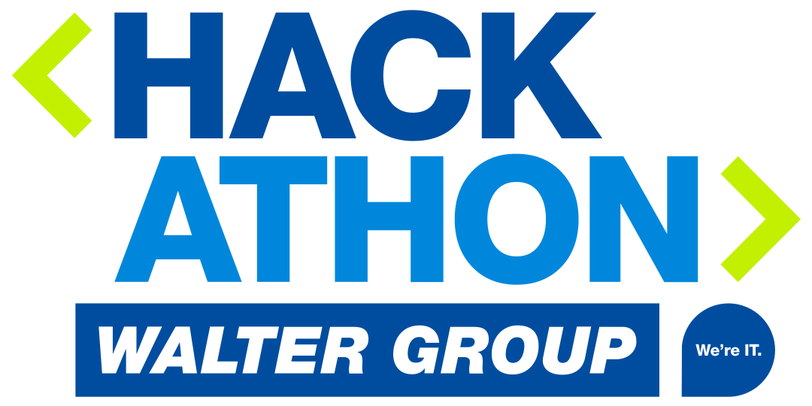
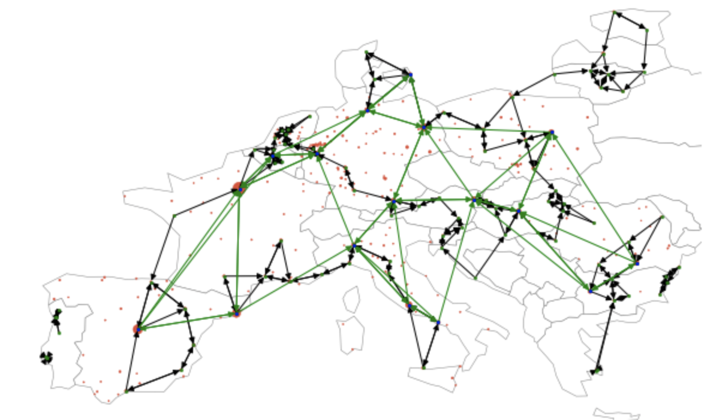
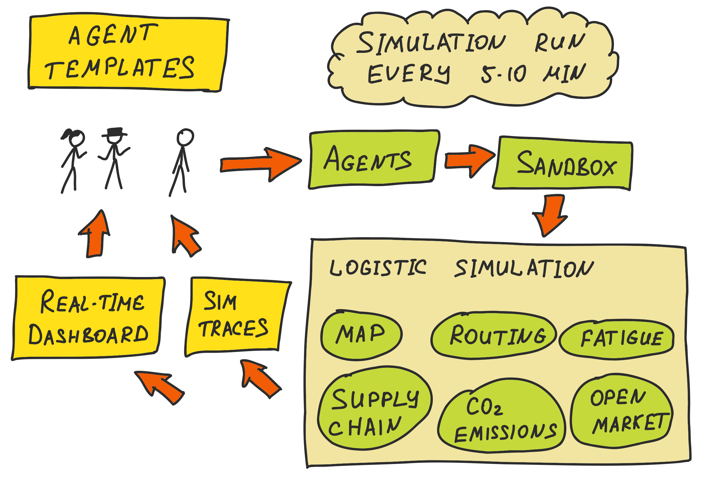
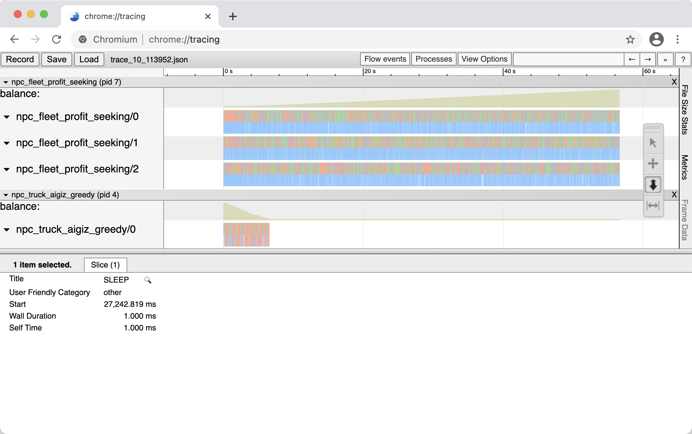
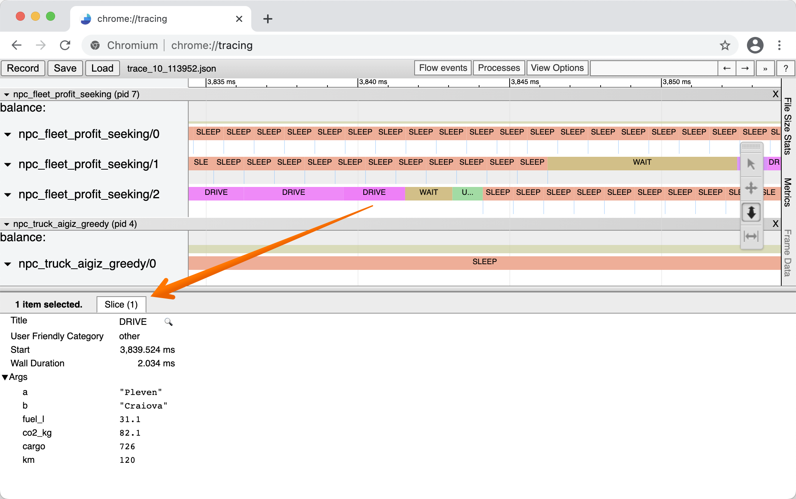
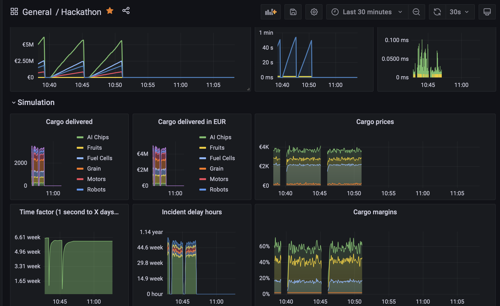
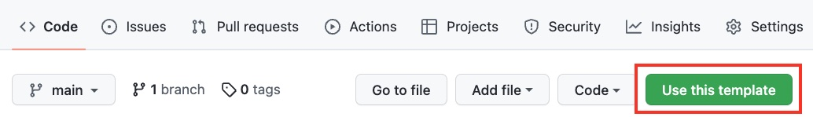

<p align="center">
  <a href="https://hackathon.walter-group.com">
    
  </a>
  <h4 align="center">This is the central repository for participants of the <br><a href="https://hackathon.walter-group.com" target="_blank">WALTER GROUP Hackathon: Sustainable Logistics</a> which explains how to participate in the competition and links to all relevant resources like agent templates. The build status of participants agents can be seen in the <a href="https://github.com/WALTER-GROUP/hackathon-sustainable-logistics/actions">GitHub Action history</a> of this repository.</h4>

  <p align="center">
    <a href="LICENSE"></img></a>
    <a href="https://www.walter-group.com"></img></a>
    <a href="https://join.slack.com/t/waltergroup-hackathon/shared_invite/zt-1jdcaqm4z-cMDXcMYG6eHlJaTR5YH0zw"></img></a>
  </p>
</p>

# Overview
Experts in data science, machine learning and software development will work together to find efficient and sustainable logistics solutions for the EU at the WALTER GROUP Hackathon: Sustainable Logistics on 13 January 2023.

Freight transports, delivery routes and logistics systems are key drivers of the European economy. They allow countries to work together across borders, achieve better results together and find efficient and sustainable solutions for the future through cooperation and collaboration. WALTER GROUP aims to foster this cooperation and brings together experts, developers and scientists to demonstrate what we can achieve by joining forces.

You do not have to be an expert in machine learning or data science. If you know how to code in one of our supported languages (C#, Java, Python) you are ready to go. A simple script making decisions via if / else branches might even be better than an involved machine learning model. We are excited to see what you can achieve!

# Simulation

We simulate a road network in Europe. For the purpose of the hackathon, it is simplified.



The world map for this road network is static and available: [map.json](data/map.json). **Map schema** is explained later.

The world map is represented by locations connected by a network of roads.  Some locations are special, as they produce goods, which will need shipping to other locations. 

Locations for producing and consuming goods are semi-deterministic and are not revealed publicly. You can analyse the **simulation trace data** to find out the patterns.

The participants of the competition will get to program trucks which can load the cargo and deliver it.  **The goal is to make money by delivering the cargo**. 

If you run out of money, your truck(s) are suspended for the current simulation run.

This is very much like economic games you might have played in high school.

## Implementation

So how does the simulation work exactly? 

The simulation runtime is provided by WALTER GROUP and is responsible for keeping track of all stats like the current list of cargo offers (= produced goods), the trucks on the map, the current simulation date and time, fuel cost and many more. 

When the simulation is started it loads the world map, generates an initial list of cargo offers and spawns the trucks of the participants randomly on the map. Then the simulation will iterate through the list of trucks and will ask each one of them for their next move decision.

Afterwards, we simulate the passing of time via [discrete-event simulation](https://en.wikipedia.org/wiki/Discrete-event_simulation). Trucks travel, time passes and we jump forward to the next important event.

## Your Workflow



1. You code an agent that controls truck(s) and submit it into the competition.
2. That agents gets packaged as a docker container
3. Regularly (every 5-10 minutes) we pull all agents in and start a new simulation run.
4. You can observe the real-time dashboards during the run. 
5. You can also download full simulation trace immediately after the run ends

The goal is to **observe, iterate and improve**.

We have two sets of rules:

- **Efficiency rules** - in effect from the start of the competition
- **Sustainability rules** - come in effect in the second half of the Hackathon

## Efficiency Rules

 These rules are in effect since the start of the game.

- Your **truck gets money for delivering** cargo. Prices are market-driven. Certain cargo types tend to have better margins out-of-the-box.
- You spend money on gas (fuel consumption uses COPERT formula for a loaded/empty truck and diesel price of `2.023`)
- **Every week, you pay fixed operational costs**. So standing idle and doing nothing is a loosing strategy. You need to hustle to keep.
- If your balance is negative at the end of the week, the truck is bankrupt until the end of the simulation run.
- Weekly revenue is taxed progressively.

## Sustainability Rules

These rules come into effect for the second part of the hackathon.

- **CO2 emissions** (computed via COPER) have an additional associated cost (CO2 offset cost)
- **Truck drivers get fatigued** over the time. Fatigue accumulates and increases the chance of road incidents. Incidents cause delay and trigger an immediate rest. Full 8-hour sleep is needed to eliminate fatigue.
- **Locations have working hours**. If a truck arrives at a location outside of its working hours, it has to wait.

## Trucks

You control trucks by implementing a `decide` function. This function is called whenever the simulation doesn't have a plan for the truck (e.g. at the start of the simulation).

The simulation runtime will build a current world state for the truck (list of available cargo) and request a decision.

Trucks can decide to **deliver a cargo**, **drive to a specific location** empty, or **let the driver sleep** for a specific amount of time:

- `DELIVER CARGO_UID` (e.g. `DELIVER 23`) - The truck reserves a specific cargo offer, drives to the current cargo location, loads the cargo onto the truck, plans a route to the cargo destination, drives there and unloads the cargo. Fatigue and working hour effects can apply here, if _Sustainability Rules_ are in effect.
- `ROUTE LOCATION` (e.g. `ROUTE Berlin`) - A truck might decide to plan a route and drive to a specific location, although it is currently empty. For example a truck could anticipate, that a lucrative cargo offer will soon be available at a location and wants to minimize the pick up and delivery time.
- `SLEEP HOURS` (e.g. `SLEEP 1` or `SLEEP 8`) - When there are no cargo offers available, or when a truck driver is already on duty for a long time, it might be the best strategy to rest for a few hours. Note, that sleeping 8 times for one hour doesn't constitute a full rest.

Each action by a truck agent is an atomic action which will always succeed. After the decision is fully executed, the truck will be able to decide again.

## Simulation time
The current time is represented by the float `time` in the simulation. It represents the number of hours that have passed since the start of the simulation. 

- A value of 13.25 means `13:15`. 
- `26.0` means `1 day 2 hours`

Each action of a truck takes time. Driving a truck on the map, takes a certain amount of time, which is calculated by the distance and the speed limits of a route. The cargo offers delivery takes 5 hours, the truck will execute all necessary steps. Additional time might pass when _Sustainability Rules_ are active, and the driver gets into an accident due to insufficient resting time (see next section).

Example: 
- `loc`=A, `time`=8 
  
  The truck decides at 8:00 to drive from A to B, which will take 5.5 hours.

- `loc`=B, `time`=13.5

  The truck arrives at 13:30 at location B.

Hint: you can get time of the day by doing a modulo operation: `tod = time mod 24`


## Resting time of truck drivers (Sustainability Only)

When _Sustainability Rules_ are active, driver fatigue mechanics come into play. 

Drivers can get tired over time. More time has passed since the last full rest (8 hours of undisturbed SLEEP), the higher the chance of road incidents during the journey. 

Road incidents cause a delay and trigger an immediate `SLEEP 8` afterwards.

## Working Hours (Sustainability Only)

When _Sustainability Rules_ are in active, cargo delivery locations have working hours. If a truck arrives at such a location outside of the working hours, it will have to wait until it is allowed to unload its cargo.

If waiting time is 8 hours or more, it counts as a full rest.


## CO2 emissions (Sustainability Only)
Driving emits CO2 which is calculated via a simplified COPERT4 formula (see also https://www.eea.europa.eu/data-and-maps/data/external/copert-4). The simulation tracks the emissions for all trucks on the map. Try to keep your emissions as low as possible, while maximizing your profit.

CO2 emissions are counted as expensses, based on the CO2 offset cost per kg.

## Cargo offers

Simulation runtime tracks cargos available for delivery. Whenever it is time for a truck to make a decision, it will receive a personalized list of cargo offers. 

```json
{
  "uid": 100,                # unique cargo ID
  "origin": "Zaragoza",      # city to pick it up
  "dest": "Innsbruck",       # destination
  "name": "Fruits",          # kind
  "price": 1778.0,           # money you get for delivery
  "eta_to_cargo": 8.16,      # ETA from current loc to pickup loc
  "km_to_cargo": 780.0,      # kms to pickup location
  "eta_to_deliver": 27.76,   # ETA for picking up and delivering
  "km_to_deliver": 2730.0    # total kms to pick up AND deliver
}
```


ETA and KM estimates are relative to the current position of the truck. They account only for the driving time, but don't account for the loading/unloading and waiting times.

You can check out for the sample cargo offers in [data/](data/) directory.

# Available Data

We have a set of data available for the deeper analysis:

- World map (static)
- Simulation traces
- Observability Dashboard

## World Map

You can [download](data/map.json) the world map. It describes the road graph as a collection of locations and roads that connect them. Estimated driving speed is also provided.

## Simulation Traces

Simulation traces could be downloaded from the [traces folder](https://traces.endpoints.walter-group-hackathon.cloud.goog). These are JSON files stored in [Chrome Tracing format](https://docs.google.com/document/d/1CvAClvFfyA5R-PhYUmn5OOQtYMH4h6I0nSsKchNAySU/preview).

Note: Simulation traces that were published before the competition start - demonstrate the mechanics, but use a slightly different world. Keep that in mind, if you decide to analyse in advance.

You can analyse the traces manually or load into the `chrome://tracing` tool. 

Navigate to `chrome://tracing` in Chrome or Chromium browser, then drag-and-drop a trace file into the tracing UI.

There you can see a detailed breakdown of every single action that happened in the simulation, for all the participants and NPC agents.



You can zoom, filter and dig into the details. Events tend to have associated data:




### Caveat - ms instead of hours

Chrome tracing simulator isn't suitable for displaying large intervals like hours. So we "hack" and pass time and durations as milliseconds instead. When you see a millisecond unit, convert it mentally into hours.

E.g.:

- "Start 3,839.524 ms " means "Start at 3839.524 hours since the start of the simulation"
- "Wall duration 2.034 ms" means "Wall duration of 2.034 hours" (roughly two hours and a minute)


### Manual Analysis

The file looks like the snippet below. Actions of all teams are intertwined there:

```json
{"name": "DRIVE", "ph": "B", "ts": 18941.0, "pid": 5, "tid": 1, "args": {"a": "Salzburg", "b": "Linz", "fuel_l": 24.19, "co2_kg": 63.86, "cargo": 15, "km": 107, "delay": 0, "incident_cost": 0}},
{"name": "DRIVE", "ph": "E", "ts": 20156.90909090909, "pid": 5, "tid": 1},
{"pid": 5, "ts": 20156.90909090909, "ph": "C", "name": "balance", "args": {"value": 24806}},
{"name": "DECIDE", "ph": "i", "ts": 19000.0, "pid": 8, "tid": 0, "s": "t", "args": {"cmd": "SLEEP", "arg": "1"}},
{"name": "SLEEP", "ph": "B", "ts": 19000.0, "pid": 8, "tid": 0},
{"name": "SLEEP", "ph": "E", "ts": 20000.0, "pid": 8, "tid": 0},
{"pid": 8, "ts": 20000.0, "ph": "C", "name": "balance", "args": {"value": 8713}},
{"name": "DECIDE", "ph": "i", "ts": 19080.0, "pid": 4, "tid": 2, "s": "t", "args": {"cmd": "SLEEP", "arg": "1"}},
{"name": "SLEEP", "ph": "B", "ts": 19080.0, "pid": 4, "tid": 2},
{"name": "SLEEP", "ph": "E", "ts": 20080.0, "pid": 4, "tid": 2},
```

Unique identifiers are `pid` (team ID). You can look them up for your truck at the beginning of the file in the `M` (Metadata) records:

```json
{"name": "process_name", "ph": "M", "pid": 1, "args": {"name": "npc_truck_naive"}},
{"name": "thread_name", "ph": "M", "pid": 1, "tid": 0, "args": {"name": "npc_truck_naive/0"}},
{"name": "process_name", "ph": "M", "pid": 2, "args": {"name": "npc_truck_rinat"}},
{"name": "thread_name", "ph": "M", "pid": 2, "tid": 0, "args": {"name": "npc_truck_rinat/0"}},
{"name": "process_name", "ph": "M", "pid": 3, "args": {"name": "npc_truck_seb"}},
{"name": "thread_name", "ph": "M", "pid": 3, "tid": 0, "args": {"name": "npc_truck_seb/0"}},
{"name": "process_name", "ph": "M", "pid": 4, "args": {"name": "npc_fleet_profit_seeking"}}
```

If you have multple trucks, they will share the same `pid` but will have different `tid`.

## Observability Dashboard

We have  dashboards with real-time insight into the system across the simulation runs. 

Each run takes 5-10 minutes, and you can see it as a separate peak on the charts.

- [General dashboard](https://telemetry.endpoints.walter-group-hackathon.cloud.goog)

 

# Competition Results

We have 4 competition tracks:

- Individual with efficiency rules
- Team with efficiency rules
- Individual with sustainability rules
- Team with sustainability rules

Winners are calculated by running the simulation 3 times (to reduce the role of luck) and picking the winner based on the average final balance across all 3 simulation runs.


# Agent template repositories and competition build system

**We recommend to perform the steps of this section at the very beginning of the Hackathon, just by using one of the supplied language templates and setting your team's agent unique ID in agent.json. After the agent build is setup you can iteratively improve the truck agents behavior.**

**Only one member of your team needs to follow these instructions!**

## 1. Create private repository from a template

To get you started quickly, we created several template repositories for you. Depending on your language preference, click on one of the links below and then click the `Use this template` button to create a new **private** repository in your GitHub account with all the contents of the template. Make sure to make this new repository private, as otherwise all of your competitors will be able to see your code.

- [C# agent template repository](https://github.com/WALTER-GROUP/hackathon-sustainable-logistics-agent-csharp)
- [Java agent template repository](https://github.com/WALTER-GROUP/hackathon-sustainable-logistics-agent-java)
- [Python agent template repository](https://github.com/WALTER-GROUP/hackathon-sustainable-logistics-agent-python)

</br>

</br>

**Optional step:** if you are working in a team and others want to contribute code as well, you can now add your colleagues as contributors to the repository. Click on the tab `Settings` and then on `Collaborators and teams` and add people on that page.

## 2. Modify your agent.json file

Clone the agent repository you created in the previous step and pick a unique ID for your team. Valid unique IDs consist of lower-case characters (`a-z`), numbers (`0-9`) and dashes (`-`). Dashes at the start, or end are not allowed.

If you are participating alone set `is_fleet` to `false`. If you are participating as a team set it to `true`.

```json
    {
      "unique_id": "walter-group",
      "is_fleet": true
    }
```

Commit and push your changes of the `agent.json` file.

## 3. Install the Hackathon GitHub app

Now install the GitHub app [WALTER GROUP Hackathon Onboarding](https://github.com/apps/walter-group-hackathon-onboarding) for the repository created in step 1). Please make sure to install the app **only for the single repository**, where your agent code resides. If you install it for all your repositories you would grant the app read access to all your private repos.

</br>

</br>

## 4. Verify it worked

Within a few seconds you should see a new entry in the public [agents.json](https://github.com/WALTER-GROUP/hackathon-sustainable-logistics/blob/main/agents.json) file. There will also be a new [GitHub Actions workflow](https://github.com/WALTER-GROUP/hackathon-sustainable-logistics/actions) created for your agent, which will be immediately triggered, whenever you push code changes to your agent repository.

If you see your agent in the `agents.json` file and its status is `Onboarded`, your agent will be participating in one of the next simulation runs. You can now focus on writing your agent code. Good luck!

<br/>
<br/>

# We are hiring

## The WALTER GROUP

- Management-run Austrian private group
- Established in 1924
- More than 4,800 employees
- Turnover for financial year 2021/2022: € 3.2 billion
- First class credit rating from international credit rating agencies

## Leading the way in Europe

The main business activities of WALTER GROUP include: **processing full truck loads** all over Europe via road and in combined transport through LKW WALTER, as well as **trading and leasing office, storage and sanitary containers** all over Europe through CONTAINEX, **investing in and leasing commercial and residential property** through WALTER BUSINESS-PARK, WALTER IMMOBILIEN and CONTAINEX IMMOBILIEN, **storage services** through WALTER LAGER-BETRIEBE and **leasing trailers and tractors** through WALTER LEASING.

## What you can expect here

Working in the WALTER GROUP means becoming part of **our big European family**. Because your future colleagues come from **41 countries** and speak **39 languages**. Nevertheless, we speak with one voice. Because several non-negotiable common interests unite us, which we are happy to share with you.

In the WALTER GROUP we see ourselves, first and foremost, as **facilitators** who **get things off the ground**. As such, we always deliver **top performance**, where others absolve themselves from responsibility saying "that's impossible".

As a European company, we are **used to push and exceed the limits**. This also applies to personal performance. Meaning, you always go the extra mile with us. Should you ever stumble, you can **rely on the help of your team**.

## Start your career here
We are hiring! If you are interested in working for WALTER GROUP, you can find all information about our employment opportunities [here](https://career.walter-group.com/uk/en/employment-opportunities#jobCategory=it).
